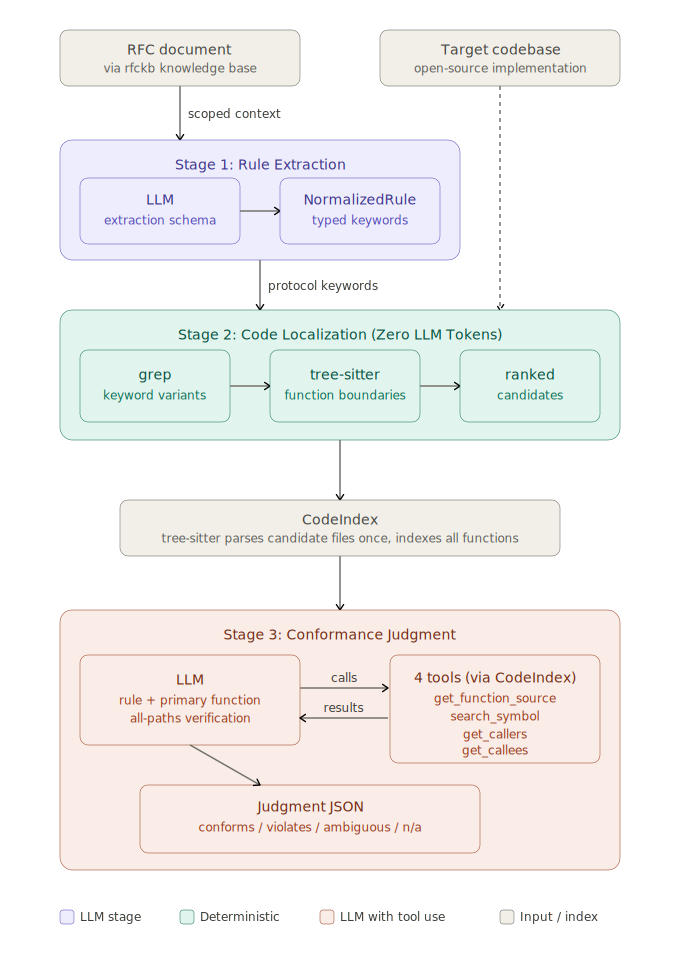

# SpecTrace

**Structured LLM Pipeline for RFC Conformance Checking in Cryptographic Implementations**

**TL;DR:** SpecTrace is a three-stage pipeline that checks whether cryptographic protocol implementations conform to their RFC specifications. It extracts normative rules from the RFC into a typed schema, localizes relevant code using grep and tree-sitter (zero LLM tokens), and performs scoped conformance checking where the LLM judges whether localized code satisfies each rule.

Two conformance-checking approaches were developed and compared:
1. **File-level prompting**, where the LLM receives entire source files alongside the rule.
2. **Function-level prompting with tool use**, where the LLM receives only the primary function body and navigates the codebase on demand through four tree-sitter-backed tools (function lookup, symbol search, caller/callee tracing).

Tested against OpenSSL's TLS 1.3 (RFC 8446) implementation, the function-level approach reduced token consumption by 94% on irrelevant code, enabled cross-file analysis that file-level prompting could not perform, and surfaced observations that required human review to interpret, including a gap in mandatory extension generation and a filtering asymmetry between related TLS extensions.

SpecTrace is an ongoing research project. Companion tool [`rfckb`](https://github.com/awe-srush/RFC-Knowledge-Base) (RFC Knowledge Base builder) is available separately.

---

## Why Specification Conformance Matters

AI-powered security tools have made extraordinary progress at finding implementation-level bugs: memory corruption, type confusion, exploitable logic errors. Tools like fuzzers and static analyzers look for code that crashes, leaks, or behaves unexpectedly. Recent work has demonstrated LLMs finding hundreds of high-severity vulnerabilities in well-tested open source software.

All of this work operates under a shared assumption: the code's intent is correct, and the implementation has flaws.

SpecTrace asks a different question. What if the code does not crash, has no memory bugs, passes every fuzzer, but simply does not do what the protocol specification says it should?

Specification deviations are not academic curiosities. They create real security risks. When an implementation sends the wrong TLS alert code, a compliant peer expecting the correct alert could mishandle the error, retry incorrectly, or fail to diagnose the problem. This is not a hypothetical scenario: [OpenSSL issue #30818](https://github.com/openssl/openssl/issues/30818) is a confirmed case where OpenSSL sends `SSL_AD_ILLEGAL_PARAMETER` instead of `SSL_AD_MISSING_EXTENSION` when a ServerHello lacks a required extension under EC(DHE) key establishment. Nothing crashes. No memory is corrupted. The implementation simply sends the wrong alert code, violating what RFC 8446 requires. When implementations deviate from the spec in different ways, the interactions between those deviations create exploitable edge cases that neither implementation's developers anticipated. When a server silently accepts malformed input that the RFC says should be rejected, that gap is exactly the kind of unexpected behavior an attacker probes for.

A fuzzer does not know what RFC 8446 says. A vulnerability scanner does not check whether an alert code matches Section 6.2's requirements. These tools look for a different class of defect entirely. SpecTrace addresses the gap between "does this code crash?" and "does this code do what the specification requires?"

## The Approach

SpecTrace decomposes conformance checking into three stages, each with a narrow, well-defined task. The key design principle is that each LLM call should have a specific, scoped job rather than attempting end-to-end reasoning over a large codebase and specification simultaneously.



### Stage 1: Rule Extraction

The pipeline begins with the RFC itself. A companion tool, [`rfckb`](https://github.com/awe-srush/RFC-Knowledge-Base), converts the RFC into a knowledge graph of linked section nodes. A configuration file specifies which sections are priority and should be included in context when querying other sections, based on the RFC's structure and cross-references. `rfckb` assembles scoped context for any given section: the section's text, its cross-referenced sections, and the priority sections.

SpecTrace sends this scoped context to an LLM with a fixed system prompt containing a rule extraction schema and a taxonomy of normative rule shapes. The LLM extracts every MUST, MUST NOT, SHOULD, and SHALL statement as a structured JSON object called a NormalizedRule.

Each NormalizedRule contains:
- The verbatim source text and section reference (for auditability)
- A rule type classification from an empirically derived taxonomy
- Typed protocol keyword slots (message types, field names, extension names, alert names, mode conditions) that drive Stage 2 localization
- A checkability rating with rationale, providing an honest assessment of whether code-level analysis can verify this rule
- Extraction confidence and ambiguity notes

The rule type taxonomy was derived empirically by extracting and categorizing normative statements across multiple structurally different RFC sections. Nine structural shapes emerged from this exercise:

| Type | What it captures |
|---|---|
| `value_constraint` | Field must equal a specific value |
| `presence_requirement` | Field or extension must be present or absent |
| `consistency_check` | Two fields or messages must agree |
| `uniqueness_constraint` | No duplicates in a list |
| `conditional_action` | If condition, then must perform action |
| `ordering_constraint` | Temporal or sequential relationship between actions |
| `behavioral_tolerance` | Must accept or ignore something |
| `message_construction` | What to include when building a message |
| `algorithmic` | Must compute or generate in a specific way |

Across 54 sections of RFC 8446, Stage 1 extracted 282 rules.

### Stage 2: Code Localization

Stage 2 is entirely deterministic. It uses zero LLM tokens.

For each extracted rule, the pipeline takes the protocol keyword slots and searches the target codebase using case-insensitive grep. This mirrors how a human developer approaches an unfamiliar codebase: before reading code, you search for the relevant terms, open the files that match, and focus on the functions that mention the concepts you care about. SpecTrace automates this intuition. Search variants are generated automatically: `key_share` also searches `KeyShare`; `ClientHello` also searches `client_hello`. This works because implementation authors read the RFC and name things after it. OpenSSL's `SSL_AD_MISSING_EXTENSION` contains the RFC term `missing_extension`. The function `tls_parse_stoc_key_share` contains `key_share`. Direct substring matching finds these reliably.

Grep results identify a small set of relevant files (typically 5 to 15 out of thousands). Tree-sitter parses these files, identifies all function definitions, and maps each grep hit to its enclosing function. Candidates are sorted by the number of distinct search terms matched per function: a function containing hits for `key_share`, `illegal_parameter`, and `ServerHello` ranks above a function that mentions only `key_share` ten times, because co-occurrence of multiple RFC terms is a stronger relevance signal than repetition of one.

Stage 2 outputs the top 10 candidate functions per rule with their file, line range, and hit metadata. This narrowing step is where the largest efficiency gain lives: the entire codebase is reduced to a handful of functions without spending any LLM tokens.

### Stage 3: Conformance Judgment

In Stage 3, the LLM receives a NormalizedRule (the structured specification requirement) alongside localized code (the implementation to check) and produces a judgment: does this code satisfy this rule? Each judgment is one of four values:

- **conforms**: every code path that handles the rule's precondition satisfies the rule's requirements
- **violates**: at least one code path handles the rule's precondition but does not satisfy the rule's requirements
- **not_applicable**: the localized code does not implement the behavior described by the rule
- **ambiguous**: conformance cannot be determined from the available code (for example, the logic depends on runtime state or code outside the search scope)

The system prompt requires all-paths verification: the LLM must check every code path that handles the rule's precondition, not just find one conforming path and stop. This directly addresses a common failure mode where a function has two branches handling the same condition with different behavior, and a naive check would stop after finding the correct one.

Each judgment includes structured evidence: specific line numbers, code snippets, reasoning about which paths were checked, and confidence level. A developer should be able to verify any judgment by reading the cited lines.

We developed and compared two approaches to this stage.

#### Approach 1: File-Level Prompting

The initial approach sent the entire source file alongside the rule in a single prompt. The LLM received the complete NormalizedRule JSON, focus guidance indicating which function to examine and why, and the full file contents.

This approach had two structural problems. First, source files in OpenSSL range from 1,000 to 5,000 lines. Sending an entire file meant the LLM processed 60,000 to 175,000 input tokens per judgment, even when the relevant code was 50 lines. Second, when conformance logic spanned multiple files (for example, a function in one file calling a validation helper defined in another), the LLM could see the call site but not the callee's implementation. It would correctly report "ambiguous" because it literally could not follow the call chain. In testing on Section 4.2.8 of RFC 8446, 8 out of 12 ambiguous judgments were caused by this cross-file blindness.

#### Approach 2: Function-Level Prompting with Tree-Sitter Tool Use

The current approach gives the LLM much less initial context but much more capability to explore. Before any judgments run, tree-sitter parses all C source and header files under the directories specified via the `--search-dirs` CLI option and builds a CodeIndex: an in-memory mapping of every function definition (name, file, line range, body text) across the search scope. This index is built once and reused across all rules.

Tree-sitter parses each file exactly once during index construction. After that, every tool call operates on in-memory data: function lookups are dictionary lookups, symbol searches scan cached bytes, and callee/caller queries use tree-sitter's QueryCursor to walk already-parsed AST subtrees without re-parsing. The entire index build takes seconds; individual tool calls take milliseconds.

For each judgment, the LLM receives only the NormalizedRule JSON and the primary function body (typically 50 to 300 lines). It also has access to four tools backed by the CodeIndex:

- **`get_function_source`**: look up any function definition by name across all indexed files. This is a dictionary lookup against the pre-built index; tree-sitter does no work at call time.
- **`search_symbol`**: find any identifier, variable, or macro across the indexed codebase. This scans already-cached source bytes with string matching and uses pre-extracted function line ranges to identify which function each match falls within. No re-parsing.
- **`get_callees`**: list all functions called by a given function. This uses tree-sitter's QueryCursor to walk the cached AST subtree for that function, scoped to the function's byte range via `set_byte_range`, extracting `call_expression` nodes. The AST was built during index construction; QueryCursor just walks the existing tree.
- **`get_callers`**: find all functions that call a given function. This runs the call expression query across all cached ASTs looking for calls to the specified name. The most expensive tool, but still milliseconds because it operates on in-memory trees.

The LLM reads the primary function, reasons about it, and calls tools as needed to trace cross-file dependencies. If it sees a call to `check_in_list`, it looks up that function's source. If it needs to know where a struct field is populated, it searches for the symbol. The conversation continues in a tool-use loop (capped at 10 calls) until the LLM has enough context to produce a judgment.

## Findings

We tested SpecTrace against OpenSSL's TLS 1.3 implementation using Claude Sonnet 4.6 for conformance judgments. We extracted 282 rules from 54 sections of RFC 8446, localized candidates for all 282 rules, and ran conformance judgments on rules from 11 sections (33 judgments total, 245 tool calls).

### Observation: `signature_algorithms_cert` parsed but never generated

RFC 8446 Section 9.2 lists seven extensions that every TLS 1.3 implementation MUST implement. The pipeline found that OpenSSL's `SSL_extension_supported()` function lists six of the seven in its switch statement. The seventh, `signature_algorithms_cert`, is missing. The LLM confirmed this by using `search_symbol` to find `TLSEXT_TYPE_signature_algorithms_cert` across the codebase and locating a comment in `extensions.c` stating: "We do not generate signature_algorithms_cert at present." OpenSSL can parse this extension when received but never generates it.

This finding illustrates a key strength of the pipeline: the ability to surface conformance questions that require careful RFC interpretation. The code analysis is precise: the extension is indeed parsed but never generated, and the LLM correctly identified this asymmetry by correlating evidence across multiple files. Whether this constitutes a conformance violation depends on how "MUST implement" is interpreted. RFC 8446 Section 4.2.3 states: "If no signature_algorithms_cert extension is present, then the signature_algorithms extension also applies to signatures appearing in certificates." The extension is designed to be functionally optional to include in messages. "MUST implement" in Section 9.2 most likely means "must be able to process when received," which OpenSSL does, rather than "must always send," which it does not.

The pipeline surfaced a real gap that required human interpretation of the RFC to resolve. This is itself a finding about the methodology: the tool-use approach reliably traces cross-file code dependencies and identifies structural asymmetries, but the final judgment on whether a code pattern violates the specification still benefits from human review of the RFC's intent.

This observation was only possible because of cross-file analysis. The violation was identified by correlating a missing entry in a switch statement (in one file) with a comment confirming non-generation (in another file) and the RFC's mandatory extension list (in the rule JSON). No single file contained the complete picture. The LLM found it in 6 tool calls and 24,430 tokens.

### Observation: filtering asymmetry between `key_share` and `supported_groups`

When analyzing the client-side construction of TLS extensions, the LLM traced through 8 functions across 4 files (10 tool calls) and identified that the `supported_groups` extension constructor applies protocol-level filters (`use_ecdhe`, `use_ffdhe`) that the `key_share` extension constructor does not. This means a group could theoretically appear in `key_share` but be filtered out of `supported_groups`, creating an inconsistency.

The judgment was "ambiguous" because whether this can trigger in practice depends on runtime configuration. This represents deeper analysis than either manual review or file-level prompting had produced on the same code. The LLM correctly identified asymmetric filtering as a code-level observation but could not (and did not claim to) construct a concrete configuration that triggers it.

### Ambiguous: cryptographic randomness verification

Two judgments on ServerHello random byte generation correctly identified that while `RAND_bytes()` is called, static analysis cannot verify the underlying CSPRNG quality. These rules were rated as genuinely hard to check structurally, validating the checkability taxonomy's classification of such rules as `algorithmic` with low checkability.

### Summary

Of the 33 total judgments: 10 conformed, 1 was flagged as a potential violation (requiring human interpretation), 2 were ambiguous (both on genuinely hard cases), and the remainder were not_applicable (localization sent files that did not implement the rule's concern).

## Token Efficiency

We compared the file-level and function-level approaches on the same rule (R01 from Section 4.2.8 of RFC 8446) across the same three source files.

| File | File-Level Tokens | Function-Level Tokens | Change | Tool Calls |
|---|---|---|---|---|
| ssl_lib.c | 175,303 | 8,863 | -95% | 0 |
| extensions_srvr.c | 72,494 | 44,845 | -38% | 2 |
| extensions_clnt.c | 80,511 | 139,505 | +73% | 10 |
| **Total** | **328,308** | **193,213** | **-41%** | **12** |

The pattern tells the story. On irrelevant code (`ssl_lib.c`), the function-level approach recognized non-applicability from just the primary function and stopped immediately: 95% fewer tokens. On straightforward checks (`extensions_srvr.c`), two targeted tool calls verified the validation chain: 38% fewer tokens, and confidence upgraded from medium to high. On complex cross-file analysis (`extensions_clnt.c`), the LLM spent more tokens but traced 8 functions across 4 files and found a real asymmetry that file-level prompting missed entirely.

The system naturally allocates effort proportional to complexity. This behavior was not explicitly programmed; it emerges from the architecture. When the LLM sees an irrelevant function, it stops. When it sees a straightforward validation, it makes a few targeted lookups. When it encounters a complex case, it uses its full tool budget.

Across all 33 function-level judgments: 2,817,743 total tokens, 245 tool calls. The breakdown of tool usage: 134 `search_symbol` calls, 102 `get_function_source` calls, 8 `get_callers` calls, 1 `get_callees` call. The LLM overwhelmingly uses symbol search and function lookup, mirroring how a human developer navigates unfamiliar code.

For the earlier file-level run on Section 4.2.8 (48 judgments): 3,270,000 total tokens. 44% of those judgments were not_applicable, consuming 1,320,000 tokens for zero useful information.

## Known Limitations

**Function-pointer dispatch.** C-based codebases that rely heavily on callback patterns and function-pointer dispatch tables present a challenge for static call-graph analysis. Tree-sitter can identify direct function calls but cannot resolve which function a pointer call invokes at runtime. When conformance logic spans a dispatch boundary (for example, a generic extension dispatcher calling a specific handler through a function pointer table), the LLM cannot trace the connection through the call graph alone. A codebase-specific dispatch map (an optional input artifact mapping dispatch table entries to handler functions) would resolve this. Codebases with more direct call structures are less affected.

**Cross-library boundaries.** Functions in separate libraries (for example, cryptographic primitive implementations in a different subsystem than the protocol logic) fall outside the search scope. Rules requiring verification of cryptographic primitive behavior remain ambiguous.

**Specification-stated rules only.** SpecTrace checks rules that are explicitly stated in the RFC. Bugs arising from internal implementation invariants that the specification does not describe (such as the Botan CVE-2026-34580 trust anchor confusion, where the violated invariant is not an RFC-stated rule) are outside SpecTrace's scope. This is a deliberate design boundary: SpecTrace covers specification conformance, not implementation correctness in general.

**Specification interpretation.** As the `signature_algorithms_cert` finding demonstrates, the pipeline's code analysis can outpace its specification interpretation. The LLM correctly identified a structural gap in the code but the significance of that gap depended on how "MUST implement" should be read. The final judgment on whether a code pattern constitutes a violation still benefits from human review of the RFC's intent.

## Current Status and Future Work

SpecTrace is an active research project. The pipeline is functional end-to-end: RFC in, conformance judgments out. The current evaluation covers RFC 8446 (TLS 1.3) against OpenSSL using Claude Sonnet 4.6.

Planned next steps include:

**Reproducibility measurement.** Running rule extraction and conformance judgment N times on the same inputs to measure agreement rates across runs. This is the core capability measurement: how reliably does the decomposed pipeline produce consistent results?

**End-to-end baseline comparison.** Running the same rules through monolithic prompting (full RFC section + full source file + "check conformance") and comparing against the decomposed pipeline on reproducibility, accuracy, and token usage.

**Multi-implementation analysis.** Checking the same RFC 8446 rules against additional TLS implementations (such as BoringSSL and mbedTLS) to surface implementation divergences. Places where implementations interpret the specification differently are exactly where interoperability bugs and exploitable edge cases live.

**Multi-model evaluation.** Extending the evaluation across multiple LLMs (Claude Opus, Gemini, GPT) to characterize how model choice affects extraction reliability, judgment accuracy, and token efficiency.

**Tree-sitter context compression.** Using tree-sitter to produce structural summaries of source files: expanding functions with grep hits fully, collapsing others to signatures. This would reduce input tokens further while preserving structural context.

## Tools and Dependencies

- **LLM:** Claude Sonnet 4.6 and Claude Opus 4.6 (via Anthropic API)
- **RFC processing:** [`rfckb`](https://github.com/awe-srush/RFC-Knowledge-Base) (separate tool)
- **Code parsing:** [tree-sitter](https://tree-sitter.github.io/) with the C grammar
- **Code localization:** grep (system utility)
- **Language:** Python 3.11+
- **Key libraries:** `anthropic`, `pydantic` v2, `tree-sitter`, `tree-sitter-c`, `click`

## Usage

```bash
# Install (requires Python 3.11+ and an Anthropic API key)
pip install -e .
export ANTHROPIC_API_KEY=your-key-here

# Stage 1: Extract rules from an RFC section
spectrace extract --context contexts/4-2-8.md --output rules/

# Stage 2: Localize code for each rule (zero LLM tokens)
spectrace localize --rules rules/rfc8446-4-2-8.json \
  --source /path/to/openssl --search-dirs ssl --search-dirs crypto \
  --output locations/

# Stage 3: Check conformance (function-level with tool use)
spectrace check --rules rules/rfc8446-4-2-8.json \
  --locations locations/ \
  --source /path/to/openssl --search-dirs ssl --search-dirs crypto \
  --output results/

# View extracted rules
spectrace list --rules-dir rules/
spectrace show --rules-dir rules/ --section 4.2.8
```

## Related Work

**AI-powered vulnerability discovery.** The trajectory from custom toolkits to autonomous 0-day discovery represents extraordinary progress on implementation-level bugs. SpecTrace is complementary: these tools find code that crashes or leaks; SpecTrace checks whether code does what its specification requires. Different failure class, different methodology, different output.

**RFCAudit** (Purdue, ASE 2025) uses end-to-end LLM reasoning for RFC conformance checking with a reported 18.1% false positive rate. SpecTrace's decomposed approach separates rule extraction (LLM), code localization (deterministic), and conformance judgment (scoped LLM with tools) to improve both reliability and auditability. Each stage produces inspectable intermediate artifacts.

**Formal protocol verification** (Tamarin, ProVerif, tlspuffin). These tools provide mathematical guarantees but require expert formalization effort. SpecTrace trades formal guarantees for accessibility and scalability: it works with natural-language specifications and commodity LLMs, making it applicable to the long tail of protocols that will never receive formal verification.

**Property-based testing** (Anthropic Frontier Red Team, January 2026). The closest methodological parallel: structured, scoped, property-driven testing. Their agent infers properties from code and tests them. SpecTrace infers properties from specifications and checks code against them. Both share the principle that scoped, structured LLM tasks outperform open-ended prompting.

## Author

Built by [Srushti](https://www.linkedin.com/in/srushti-chaukhande/) at the University of Washington. SpecTrace builds on my prior work contributing Python language support to Google's open-source Vanir security scanner.
